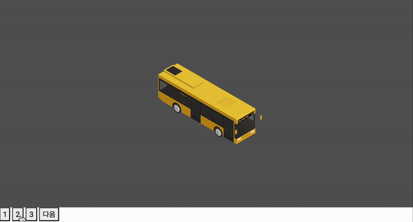

# coding-apple-study

## 목차

1. [**JavaScript Basic - level 1**](#1)
1. [**JavaScript Basic - level 2**](#2)

<br />

<div id="1"></div>

## 🍏 JavaScript Basic - level 1

- JS 코드 작성시 주의사항

  - 조작할 html의 코드를 하단에 잘 짜야함
  - 셀렉터 오타 주의
  - 기본 문법 오타 (대소문자..)

  ```javascript
  // function은 코드 축약이 가능하고, 긴 코드를 재사용 해야하는 경우가 많을때도 편리

  function 아이디알림창() {
  	document.getElementById("alert").style.display = "block";
  	document.getElementById("title").innerHTML = "아이디 입력하세요";
  }
  function 비밀번호알림창() {
  	document.getElementById("alert").style.display = "block";
  	document.getElementById("title").innerHTML = "비번 입력하세요";
  }

  // 비슷한 기능들은 파라미터 문법을 사용하여, 코드를 단축하기

  function alertOpen() {
  	document.getElementById("alert").style.display = "block";
  }

  function alertClose() {
  	document.getElementById("alert").style.display = "none";
  }

  // addEventListener 적용

  document.getElementById("close").addEventListener("click", function () {
  	document.getElementById("alert").style.display = "none";
  });
  ```

- `querySelector`

  ```javascript
  document.querySelector(".navbar-toggler").addEventListener("click", function () {
  	document.getElementsByClassName("list-group")[0].classList.add("show"); // show라는 클래스명 추가
  });

  document.querySelector(".navbar-toggler").addEventListener("click", function () {
  	document.querySelectorAll(".list-group")[0].classList.toggle("show"); // show라는 클래스가 있으면 제거, 없으면 추가
  });
  ```

- `jQuery`

  - 라이브러리이고, 함수명이 짧아진다는 장점이 있음
  - `querySelector`와 달리, `jQuery`는 클래스, 아이디, 태그 이름 등을 사용해 DOM 요소를 선택하고, 선택된 요소들에 대해 속성 변경, 스타일 적용, 이벤트 처리 등을 한 번에 쉽게 할 수 있음

  ```html
  <script
  	src="https://code.jquery.com/jquery-3.7.1.min.js"
  	integrity="sha256-/JqT3SQfawRcv/BIHPThkBvs0OEvtFFmqPF/lYI/Cxo="
  	crossorigin="anonymous"
  ></script>
  ```

- 📍 [실습] 아이디와 비밀번호 공백 검사

  - 일반 JavaScript로 addEventListener 적용

  ```javascript
  document.querySelector(".send").addEventListener("click", function (e) {
  	if (document.querySelector("#id").value == "") {
  		e.preventDefault(); // 폼 전송을 막음
  		alert("아이디를 입력해주세요");
  	}
  	if (document.querySelector("#password").value == "") {
  		e.preventDefault();
  		alert("비밀번호를 입력해주세요");
  	} else if (document.querySelector("#password").value.length < 6) {
  		e.preventDefault();
  		alert("비밀번호 길이가 6자 미만입니다");
  	}
  });
  ```

  - jQuery로 addEventListener 적용

  ```javascript
  $(".send").on("click", function (e) {
  	if ($("#id").val() == "") {
  		e.preventDefault(); // 폼 전송을 막음
  		alert("아이디를 입력해주세요");
  	}
  	if ($("#password").val() == "") {
  		e.preventDefault();
  		alert("비밀번호를 입력해주세요");
  	} else if ($("#password").val().length < 6) {
  		e.preventDefault();
  		alert("비밀번호 길이가 6자 미만입니다");
  	}
  });
  ```

- 비교
  - $('셀렉터')로 찾으면, jQuery 함수만 붙일 수 있음
  - querySelector('셀렉터')로 찾으면, 자바스크립트 함수만 붙일 수 있음

<br />

<div id="2"></div>

## 🍏 JavaScript Basic - level 2

- 📍 [실습] 캐러셀 (이미지 슬라이드) 만들기

  |                                             캐러셀 (이미지 슬라이드) 구현 화면                                              |
  | :-------------------------------------------------------------------------------------------------------------------------: |
  |  |

  - 다음 버튼 구현

  ```javascript
  let page = 1;
  $(".next").on("click", function () {
  	if (page === 1) {
  		$(".slide-container").css("transform", "translateX(-100vw)");
  		page++;
  	} else if (page === 2) {
  		$(".slide-container").css("transform", "translateX(-200vw)");
  		page++;
  	} else if (page === 3) {
  		$(".slide-container").css("transform", "translateX(0vw)");
  		page = 1;
  	}
  });
  ```

  - 확장성 좋은 다음 버튼 구현

  ```javascript
  let page = 1;
  $(".next").on("click", function () {
  	if (page !== 3) {
  		$(".slide-container").css("transform", "translateX(-" + page + "00vw)");
  		page += 1;
  	} else {
  		page = 0;
  		$(".slide-container").css("transform", "translateX(-" + page + "00vw)");
  	}
  });
  ```

  - 숫자 버튼 구현

  ```javascript
  $(".slide-1").on("click", function () {
  	$(".slide-container").css("transform", "translateX(0vw)");
  });
  $(".slide-2").on("click", function () {
  	$(".slide-container").css("transform", "translateX(-100vw)");
  });
  $(".slide-3").on("click", function () {
  	$(".slide-container").css("transform", "translateX(-200vw)");
  });
  ```
